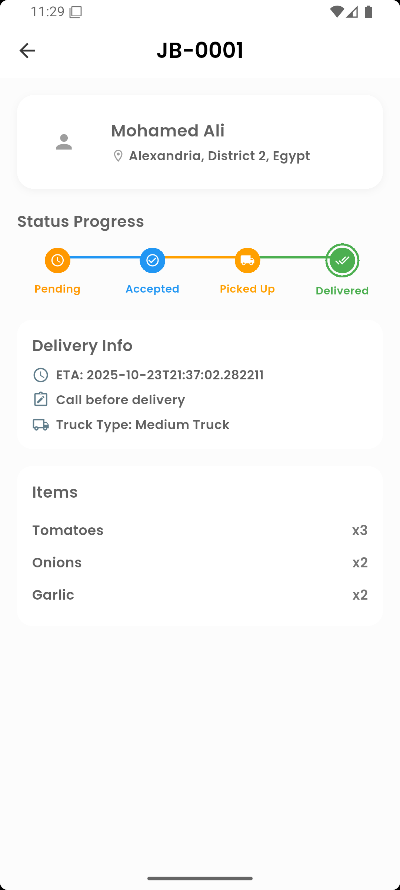
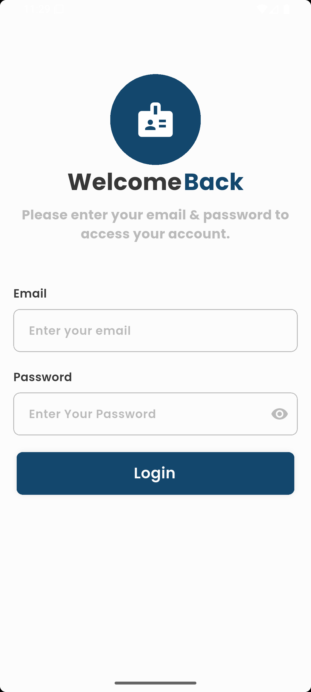
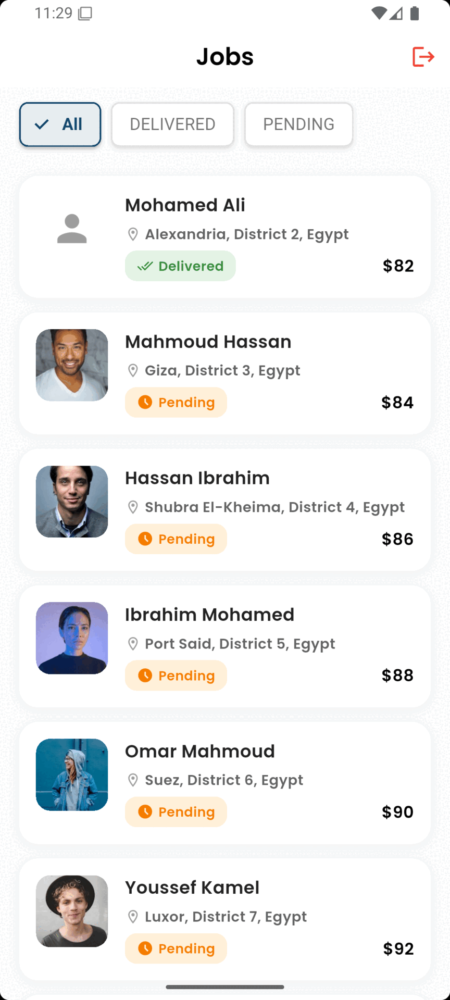

# 🚀 Flutter ERP Task App

A complete job management application built with **Flutter** for the **Agribasket Developer Assessment**.

## 📱 Features

- **User Authentication** – Secure login with token management  
- **Job List** – Paginated list with infinite scroll  
- **Status Management** – Update job status with optimistic UI  
- **Filtering** – Real-time status filtering  
- **Offline Support** – Basic offline queue for updates  
- **Modern UI** – Professional, responsive design  

## 🛠️ Tech Stack

- **Flutter 3.0+** with Dart 3.0+  
- **BLoC / Cubit** for state management  
- **Dio** for networking  
- **SharedPreferences** for local caching  
- **flutter_routes** for navigation  

## 🚀 Getting Started

### Prerequisites

- Flutter **3.0.0+**
- Dart **3.0.0+**

### Installation

```bash
git clone https://github.com/mohamedhisham1369/taskapp.git
cd taskapp
flutter pub get
flutter run
```

### Build APK

```bash
flutter build apk --debug
```

## 📸 Screenshots

**Job List Screen**  


**Job Details Screen**  


**Login Screen**  



**App Demo**  


## 📦 Download APK

You can try the app directly by downloading the APK below 👇

👉 [**Download Latest APK**](apk/app-release.apk)
## 📁 Project Structure

```plaintext
lib/
├── core/
│   ├── cache_helper/
│   ├── themes/
│   ├── utils/
│   ├── routing/
│   └── extensions/
├── features/
│   ├── authentication/
│   └── jobs/
│       ├── data/
│       │   ├── models/
│       │   └── repos/
│       ├── domain/
│       │   └── cubits/
│       └── presentation/
│           ├── screens/
│           └── widgets/
└── main.dart
```

## 🔌 API

**Base URL:**  
```
https://68f6b896f7fb897c661366d7.mockapi.io/api/v1
```

**Endpoints:**

| Method | Endpoint | Description |
|--------|-----------|-------------|
| POST | `/auth/login` | User login |
| GET | `/job?page=1&limit=10` | Paginated job list |
| GET | `/job/:id` | Fetch job details |
| put | `/job/:id` | Update job status |

**Demo Credentials:**
```
Email: demo@demo.com
Password: password
```

## 🎯 Implementation

### State Management
- **JobCubit** – Manages job list, pagination, and filtering  
- **JobDetailsCubit** – Handles job status updates

### Core Features
- **Pagination** – Infinite scroll with load more  
- **Filtering** – Chip-based real-time filters  
- **Optimistic UI** – Instant feedback with rollback on failure  
- **Offline Queue** – Queued updates for offline mode  

## 📝 Requirements Coverage

| Requirement | Status |
|--------------|--------|
| Flutter 3.x + Dart | ✅ |
| State Management | ✅ |
| Networking | ✅ |
| Authentication | ✅ |
| Pagination | ✅ |
| Status Updates | ✅ |
| Offline Support | ⚠️ (Basic Queue) |
| Testing | ✅ |
| UI/UX Polish | ✅ |

## ⚙️ Known Issues & Limitations

- 💤 **Offline Mode:** Only basic queueing is implemented; complex sync logic is not yet included.  
- 🔒 **Error Handling:** Some network errors show generic messages.  


## 👨‍💻 Developer

**Mohamed Hisham**  
GitHub: [@mohamedhisham1369](https://github.com/mohamedhisham1369)  

Built for **Agribasket Flutter Developer Assessment – October 2025**

## ✅ Submission Instructions

1. Create this README file in your project root.  
2. Update the `description` field in your `pubspec.yaml`.  
3. Push changes to GitHub:

```bash
git add README.md
git commit -m "Add project documentation"
git push origin main
```


## 🕒 DEVELOPMENT TIMELINE

🕒 DEVELOPMENT TIMELINE

Phase              | Description                                           | Duration
-------------------|-------------------------------------------------------|-----------
Phase 1            | Setting up the backend mock API (using mockapi.io)   | ~2–3 hours
Phase 2            | Project setup, architecture design, authentication   | ~10 minutes
Phase 3            | Job listing, pagination, and filtering               | ~1 hour
Phase 4            | Job details, status update, and optimistic UI        | ~1 hour
Phase 5            | Offline queue, UI polish, and testing                | ~1 hour
-------------------|-------------------------------------------------------|-----------
Additional Testing | Final QA and validation                              | ~30 minutes
-------------------|-------------------------------------------------------|-----------
Total Development Time                                                    | **~5.5–6.5 hours**

## 🧠 NOTE:
The backend API used in this project is a MOCK API (for example, using mockapi.io or Beeceptor).
Configuring or hosting the backend service is NOT part of the Flutter developer’s responsibilities.
This app simply consumes the given API endpoints according to the assessment requirements.

When you log in, the app sends a POST request to the mock API and stores the returned user data locally.
User validation is NOT actually performed — this is just a simulated process to demonstrate the
authentication flow from the Flutter side. Implementing real authentication logic or backend validation
is outside the scope of this Flutter assessment, as I am not responsible for backend development.